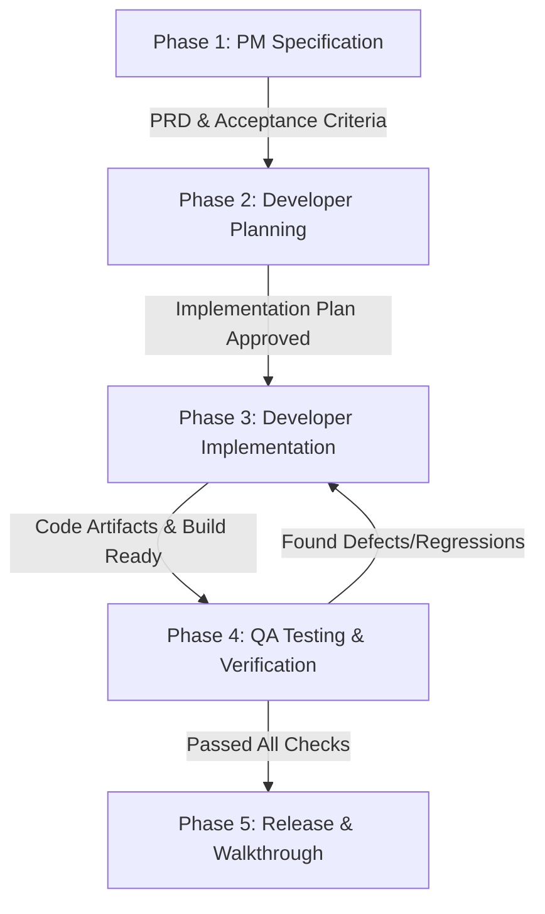

# Autonomous AI Agent Team - Smart Budget Monitoring & QC System

Sistem orkestrasi tim agen otonom Google Antigravity untuk pengembangan, pengujian, dan pemeliharaan proyek **Smart Budget Monitoring System** (PT Summit Adyawinsa Indonesia).

---

## 1. Komposisi Tim Agen

```
                      ┌────────────────────────────────────────┐
                      │         Product Owner / PM             │
                      │  (Requirements, Specs & Acceptance)   │
                      └──────────────────┬─────────────────────┘
                                         │
                                         ▼
                      ┌────────────────────────────────────────┐
                      │          Fullstack Developer           │
                      │ ┌──────────────────┐ ┌───────────────┐ │
                      │ │ Backend (Flask)  │ │Frontend (Vite)│ │
                      │ └──────────────────┘ └───────────────┘ │
                      └──────────────────┬─────────────────────┘
                                         │
                                         ▼
                      ┌────────────────────────────────────────┐
                      │               QA Tester                │
                      │ (Unit/Integration Test & Verification) │
                      └────────────────────────────────────────┘
```

| Peran Agen | Identitas Profil | Fokus Utama | Artefak Output |
| :--- | :--- | :--- | :--- |
| **Product Owner / Manager** | [product_manager.md](file:///.agents/profiles/product_manager.md) | Requirement analysis, user story, PRD, validasi proses bisnis QC & Budget SAI | `PRD.md`, `TODO.md`, `implementation_plan.md` |
| **Developer (Backend & Frontend)** | [developer.md](file:///.agents/profiles/developer.md) | Implementasi arsitektur Flask, MySQL, ML (TF-IDF/SVM), UI React & CSS Modules | Source code `backend/`, `frontend/`, API Endpoints |
| **QA Tester** | [qa_tester.md](file:///.agents/profiles/qa_tester.md) | Validasi build, unit test, endpoint testing, UI verification, regression audit | Test suites, `walkthrough.md`, bug reports |

---

## 2. Pipeline Alur Kerja (Workflow Pipeline)

Setiap iterasi fitur, perbaikan bug, atau refactoring mengikuti pipeline 5-tahap otonom:



### Fase 1: Spesifikasi & Penyelarasan Kebutuhan (PM)
1. Menganalisis permintaan pengguna, dokumen referensi budget, proses bisnis QC PT SAI.
2. Memperbarui `TODO.md` dan menyusun target *acceptance criteria*.
3. Mengidentifikasi dampak terhadap skema database (`smart_budget_db`), API REST, dan alur UI.

### Fase 2: Perancangan Arsitektur (PM + Developer)
1. Developer merancang `implementation_plan.md` mencakup:
   - Modifikasi model & controller Flask (`backend/controllers/`, `backend/models/`).
   - Endpoint API baru / perubahan payload.
   - Komponen React frontend & styling CSS Modules.
   - Penyesuaian pipeline SVM / Fuzzy Matching jika terkait PR/PO.
2. Mendapatkan persetujuan sebelum eksekusi kode.

### Fase 3: Implementasi Kode (Developer)
1. Mengaktifkan skill `.agents/skills/code_generation/` dan `.agents/skills/api_integration/`.
2. Menulis kode backend sesuai prinsip MVC dan clean error handling.
3. Menulis komponen frontend responsif, modern, dan konsisten (menggunakan Lucide icons, token warna netral).
4. Menjaga tidak ada broken state atau compile error.

### Fase 4: Pengujian & Validasi Otonom (QA Tester)
1. Mengaktifkan skill `.agents/skills/automated_testing/`.
2. Menjalankan test suite backend & frontend:
   - Validasi skema DB & seeder (`python backend/database/seed.py`).
   - Validasi endpoint REST API.
   - Validasi build frontend bundle (`npm --prefix frontend run build`).
3. Jika ditemukan isu (misal: layout patah, broken endpoint, unhandled promise), QA mengirimkan laporan kembali ke Developer.

### Fase 5: Finalisasi & Dokumentasi (PM + QA)
1. Membuat/memperbarui `walkthrough.md` dengan bukti verifikasi dan ringkasan perubahan.
2. Memperbarui status task di `TODO.md`.
3. Memastikan semua konfigurasi sensitif tetap terlindungi di `.env`.

---

## 3. Direktori Konfigurasi Agen

Struktur folder agen terorganisir di dalam direktori `.agents/`:

```
.agents/
├── profiles/
│   ├── product_manager.md      # Persona & SOP Product Manager
│   ├── developer.md            # Persona & SOP Fullstack Developer
│   └── qa_tester.md            # Persona & SOP QA Tester
└── skills/
    ├── code_generation/
    │   ├── SKILL.md            # Standar skill Antigravity
    │   ├── instruction.md      # Panduan teknis arsitektur kode
    │   └── config.yaml         # Konfigurasi parameter skill
    ├── automated_testing/
    │   ├── SKILL.md
    │   ├── instruction.md      # Panduan pengujian otomatis
    │   └── config.yaml
    └── api_integration/
        ├── SKILL.md
        ├── instruction.md      # Panduan integrasi REST API & CORS
        └── config.yaml
```
