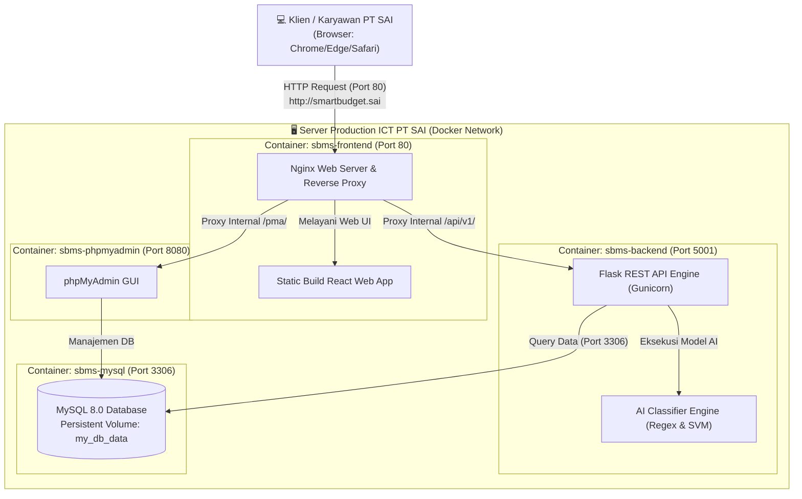
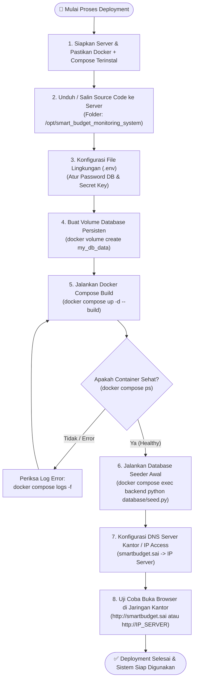

# 🚀 Panduan Deployment Sistem — Tim ICT PT Summit Adyawinsa Indonesia (SAI)

> **Dokumen Resmi**: Panduan Instalasi, Deployment, Konfigurasi Jaringan, dan Pemeliharaan Sistem  
> **Nama Aplikasi**: Smart Budget Monitoring & PR Verification System (SBMS)  
> **Target Pengguna**: Tim Information and Communication Technology (ICT) PT SAI  
> **Versi Dokumen**: 2.0 (Production Docker Stack)  
> **Status**: Terverifikasi & Siap Rilis  

---

## 📌 Daftar Isi
1. [Gambaran Umum Arsitektur Sistem](#1-gambaran-umum-arsitektur-sistem)
2. [Diagram Alur Deployment (Mermaid)](#2-diagram-alur-deployment-mermaid)
3. [Spesifikasi Server yang Dibutuhkan](#3-spesifikasi-server-yang-dibutuhkan)
4. [Daftar Port & Layanan Container](#4-daftar-port--layanan-container)
5. [Panduan Langkah Demi Langkah Deployment](#5-panduan-langkah-demi-langkah-deployment)
6. [Konfigurasi DNS & Akses Domain Perusahaan](#6-konfigurasi-dns--akses-domain-perusahaan)
7. [Prosedur Pengujian & Health Check](#7-prosedur-pengujian--health-check)
8. [Standar Pemeliharaan Rutin ICT (SOP)](#8-standar-pemeliharaan-rutin-ict-sop)
9. [Panduan Backup & Restore Database](#9-panduan-backup--restore-database)
10. [Panduan Troubleshooting & FAQ](#10-panduan-troubleshooting--faq)

---

## 1. Gambaran Umum Arsitektur Sistem

Aplikasi **Smart Budget Monitoring System (SBMS)** berjalan di atas **Docker Container** yang terisolasi dan mandiri. Tim ICT tidak perlu menginstal Python, Node.js, atau modul Apache secara manual di OS server induk (*Host OS*).

Sistem terdiri dari **4 Container Utama**:
1. **`sbms-frontend` (Nginx + React SPA)**: Berfungsi sebagai *Web Server* utama, melayani antarmuka pengguna (*Frontend React*), dan bertindak sebagai *Reverse Proxy* untuk meneruskan *request API* ke backend.
2. **`sbms-backend` (Python Flask + Gunicorn + AI Engine)**: Melayani REST API bisnis, kalkulasi pagu anggaran (E-1, E-9, I-1, OOP), serta mesin klasifikasi AI (Regex + SVM Machine Learning).
3. **`sbms-mysql` (MySQL 8.0 Enterprise Database)**: Menyimpan seluruh master data, anggaran, riwayat verifikasi PR, data kasbon entertainment, dan audit trail.
4. **`sbms-phpmyadmin` (Web Database GUI)**: Antarmuka berbasis web untuk mempermudah Tim ICT dalam menginspeksi, membackup, atau mengelola database tanpa harus masuk ke CLI.



---

## 2. Diagram Alur Deployment (Mermaid)

Berikut adalah urutan langkah yang harus dijalankan Tim ICT dari server kosong hingga aplikasi live dan dapat diakses oleh seluruh departemen:



---

## 3. Spesifikasi Server yang Dibutuhkan

| Komponen | Spesifikasi Minimum | Rekomendasi ICT Production |
| :--- | :--- | :--- |
| **Sistem Operasi** | Linux Ubuntu Server 22.04 LTS / Debian 12 / Rocky Linux 9 | Ubuntu Server 24.04 LTS (64-bit) |
| **Processor (CPU)** | 2 Core vCPU | 4 Core vCPU |
| **Memory (RAM)** | 4 GB | 8 GB DDR4 |
| **Penyimpanan (Disk)** | 25 GB SSD Free Space | 50 GB NVMe SSD |
| **Jaringan (LAN)** | 100 Mbps (IP Statis Kantor) | 1 Gbps LAN Internal PT SAI |
| **Perangkat Lunak** | Docker Engine 24+ & Docker Compose v2+ | Docker Engine Latest + Automated Backup Cron |

> [!IMPORTANT]
> Pastikan server memiliki **IP Statis (Static IP)** di jaringan lokal PT SAI (misalnya `192.168.1.100` atau subnet server kantor), agar alamat aplikasi tidak berubah-ubah saat server reboot.

---

## 4. Daftar Port & Layanan Container

| Nama Container | Layanan Internal | Port Host (Server) | Deskripsi Akses |
| :--- | :--- | :---: | :--- |
| **`sbms-frontend`** | Nginx Web Server + React | **`80`** | **Akses Utama Pengguna** (`http://smartbudget.sai` atau `http://<IP_SERVER>`) |
| **`sbms-backend`** | Flask Gunicorn REST API | **`5001`** | API Backend & Swagger Docs (`http://<IP_SERVER>:5001/apidocs/`) |
| **`sbms-phpmyadmin`** | Database Web GUI | **`8080`** *(atau `/pma`)* | Pengelolaan Database MySQL untuk Tim ICT |
| **`sbms-mysql`** | MySQL Database Server | **`3306`** | Koneksi Database MySQL (User: `root`) |

---

## 5. Panduan Langkah Demi Langkah Deployment

### Langkah 1: Install Docker & Docker Compose di Server
Jika server Linux belum memiliki Docker, jalankan perintah standar resmi berikut:

```bash
# Update repository server
sudo apt update && sudo apt upgrade -y

# Install dependensi dasar
sudo apt install -y curl wget git nano net-tools

# Unduh dan jalankan script resmi instalasi Docker
curl -fsSL https://get.docker.com -o get-docker.sh
sudo sh get-docker.sh

# Tambahkan user admin ke grup docker agar tidak perlu sudo berulang kali
sudo usermod -aG docker $USER

# Aktifkan service Docker agar otomatis start saat server menyala
sudo systemctl enable docker
sudo systemctl start docker

# Verifikasi instalasi
docker --version
docker compose version
```

---

### Langkah 2: Pindahkan Project ke Server
Posisikan source code aplikasi di direktori standar server (misal `/opt` atau home directory):

```bash
# Pindah ke direktori /opt
cd /opt

# Clone dari repository Git atau salin folder project via SCP/SFTP
git clone <URL_REPOSITORY_GIT> smart_budget_monitoring_system

# Masuk ke folder project
cd smart_budget_monitoring_system
```

---

### Langkah 3: Konfigurasi File Environment (`.env`)
Salin file template `.env.example` menjadi `.env`, lalu atur keamanan password:

```bash
cp .env.example .env
nano .env
```

Sesuaikan parameter berikut di dalam file `.env`:
```ini
# --- Database Configuration ---
DB_HOST=mysql
DB_PORT=3306
DB_NAME=smart_budget_db
DB_USER=root
# PENTING: Ganti dengan password kuat standar keamanan ICT PT SAI!
DB_PASSWORD=P@ssw0rdSAI2026!

# --- Security Keys ---
# Ganti dengan kombinasi string acak panjang untuk enkripsi sesi JWT
SECRET_KEY=sai-smart-budget-prod-secret-key-super-secure-999
JWT_SECRET_KEY=sai-jwt-token-key-super-secure-production-2026

# --- Ports ---
FRONTEND_PORT=80
BACKEND_PORT=5001
MYSQL_PORT=3306
PMA_PORT=8080

# --- Environment Mode ---
FLASK_ENV=production
```
*(Tekan `Ctrl + O` lalu `Enter` untuk menyimpan, lalu `Ctrl + X` untuk keluar dari nano).*

---

### Langkah 4: Buat Volume Persisten untuk Database
Database aplikasi menggunakan Docker Volume eksternal bernama `my_db_data` agar data **tidak pernah terhapus** saat container di-restart atau di-update.

```bash
# Buat volume database jika belum pernah dibuat
docker volume create my_db_data

# Verifikasi volume sudah terdaftar
docker volume ls | grep my_db_data
```

---

### Langkah 5: Build dan Jalankan Seluruh Layanan (Docker Compose)
Eksekusi pembangunan dan peluncuran seluruh container di background:

```bash
# Build dan nyalakan seluruh container
docker compose up -d --build
```

Tunggu proses download image dan build selesai (sekitar 2–3 menit pada eksekusi pertama kali).

---

### Langkah 6: Verifikasi Status Container
Pastikan seluruh 4 container berstatus **Up (healthy)**:

```bash
docker compose ps
```

*Contoh output yang benar:*
```text
NAME              IMAGE                          STATUS                   PORTS
sbms-backend      smart-budget-backend           Up (healthy)             0.0.0.0:5001->5001/tcp
sbms-frontend     smart-budget-frontend          Up                       0.0.0.0:80->80/tcp
sbms-mysql        mysql:8.0                      Up (healthy)             0.0.0.0:3306->3306/tcp
sbms-phpmyadmin   phpmyadmin:latest              Up                       0.0.0.0:8080->80/tcp
```

---

### Langkah 7: Inisialisasi Database (Hanya Saat Pertama Kali Deploy)
Jika database baru dibuat dan masih kosong, jalankan seeder untuk mengisi data pengguna awal (`admin` & `manager`) serta master kategori anggaran:

```bash
docker compose exec backend python database/seed.py
```

> [!TIP]
> **Akun Default Awal Sistem**:
> * **Username**: `admin` | **Password**: `admin123` (Role Administrator - Full Access)
> * **Username**: `manager` | **Password**: `manager123` (Role Management / Monitoring View)
> * *Segera minta pengguna untuk mengganti password setelah berhasil login pertama kali.*

---

## 6. Konfigurasi DNS & Akses Domain Perusahaan

Agar karyawan PT SAI tidak perlu menghafal alamat IP server (misal `192.168.1.100`), Tim ICT disarankan mendaftarkan domain lokal pada DNS Server Kantor (Active Directory / Mikrotik DNS Static / Pi-hole).

### Opsi A: Konfigurasi di DNS Server Kantor (Rekomendasi Terbaik)
Daftarkan DNS record di router / server domain PT SAI:
* **Record A**: `smartbudget.sai` $\rightarrow$ `192.168.1.100` (Arahkan ke IP Server)
* **Record A**: `pma.smartbudget.sai` $\rightarrow$ `192.168.1.100` (Opsional untuk Web Database)

Dengan cara ini, seluruh komputer di kantor PT SAI yang tersambung ke WiFi/LAN kantor langsung bisa mengetik `http://smartbudget.sai` di browser tanpa setting manual di tiap komputer.

### Opsi B: Akses Langsung Menggunakan IP Server
Jika belum sempat menyetel DNS Server, seluruh pengguna kantor bisa langsung membuka:
* **Web Aplikasi**: `http://192.168.1.100`
* **Database phpMyAdmin**: `http://192.168.1.100:8080` atau `http://192.168.1.100/pma/`

### Opsi C: Setting di Komputer Klien Tertentu (Testing Mandiri)
Di laptop klien, buka `hosts` file:
* **Windows**: `C:\Windows\System32\drivers\etc\hosts`
* **Mac/Linux**: `/etc/hosts`

Tambahkan baris berikut:
```text
192.168.1.100    smartbudget.sai pma.smartbudget.sai
```

---

## 7. Prosedur Pengujian & Health Check

Setelah deployment selesai, lakukan 4 tes cepat berikut untuk memastikan sistem siap 100%:

### 1. Uji Endpoint Health Backend
```bash
curl -I http://localhost:5001/health
# Harus mengembalikan: HTTP/1.1 200 OK
```

### 2. Uji Layanan Web Frontend
Buka browser dan akses `http://smartbudget.sai` atau `http://localhost`. Halaman login PT Summit Adyawinsa Indonesia harus muncul dengan logo dan form login yang rapi.

### 3. Uji Autentikasi Login
* Masukkan username `admin` dan password `admin123`.
* Pastikan halaman Dashboard menampilkan grafik pagu anggaran dan tabel evaluasi KPI bulanan.

### 4. Uji Akses phpMyAdmin
* Buka `http://localhost:8080` atau `http://smartbudget.sai/pma/`.
* Masukkan Server: `mysql`, User: `root`, Password: `<DB_PASSWORD dari .env>`.
* Pastikan database `smart_budget_db` terlihat dengan tabel-tabel seperti `budget`, `kategori`, `pr_po_data`, dll.

---

## 8. Standar Pemeliharaan Rutin ICT (SOP)

### Cara Melihat Log Aplikasi (Debugging)
Jika ada laporan error dari user, Tim ICT dapat mengecek log container secara live:

```bash
# Cek seluruh log gabungan
docker compose logs -f

# Cek log backend Flask (kalkulasi & AI error)
docker compose logs -f backend

# Cek log Nginx Frontend (traffic web & request)
docker compose logs -f frontend

# Cek log MySQL
docker compose logs -f mysql
```

### Cara Me-restart Layanan
```bash
# Restart semua container
docker compose restart

# Restart hanya backend (misal setelah ubah konfigurasi)
docker compose restart backend

# Restart hanya web frontend
docker compose restart frontend
```

### Cara Mematikan & Menyalakan Kembali Sistem
```bash
# Mematikan sistem dengan aman (data tetap utuh di volume)
docker compose down

# Menyalakan kembali sistem
docker compose up -d
```

### Cara Melakukan Update Versi Baru Aplikasi
Ketika ada pembaruan kode dari tim pengembang, lakukan update tanpa menghapus data database:

```bash
cd /opt/smart_budget_monitoring_system

# 1. Ambil kode terbaru dari Git
git pull origin main

# 2. Build ulang container dengan kode baru
docker compose up -d --build

# 3. Verifikasi container berjalan normal
docker compose ps
```
> [!NOTE]
> Database tidak akan terhapus karena tersimpan di persistent volume `my_db_data`.

---

## 9. Panduan Backup & Restore Database

### A. Backup Otomatis Harian (SOP Rekomendasi ICT)
Buat script backup sederhana untuk disimpan di cron job server:

```bash
# Buat folder backup
sudo mkdir -p /var/backups/smart_budget

# Jalankan dump database ke file .sql terkompresi (.gz)
docker exec sbms-mysql mysqldump -u root -p$(grep DB_PASSWORD .env | cut -d '=' -f2) smart_budget_db | gzip > /var/backups/smart_budget/backup_$(date +\%F_\%H\%M).sql.gz
```

Pasang di `crontab -e` server agar berjalan setiap hari pukul 23:00 WIB:
```cron
0 23 * * * cd /opt/smart_budget_monitoring_system && docker exec sbms-mysql mysqldump -u root -p$(grep DB_PASSWORD .env | cut -d '=' -f2) smart_budget_db | gzip > /var/backups/smart_budget/backup_$(date +\%F).sql.gz
```

### B. Restore Database dari File Backup
Jika terjadi bencana data atau ingin memulihkan database ke tanggal tertentu:

```bash
# 1. Unzip file backup jika terkompresi
gunzip -k /var/backups/smart_budget/backup_2026-09-10.sql.gz

# 2. Masukkan data kembali ke MySQL container
docker exec -i sbms-mysql mysql -u root -p$(grep DB_PASSWORD .env | cut -d '=' -f2) smart_budget_db < /var/backups/smart_budget/backup_2026-09-10.sql
```

---

## 10. Panduan Troubleshooting & FAQ

#### Q1: Muncul error *"port 80 is already allocated"* saat `docker compose up`?
* **Penyebab**: Di server induk sudah ada Apache atau Nginx bawaan yang sedang berjalan di port 80.
* **Solusi**:
  1. Hentikan Apache/Nginx host: `sudo systemctl stop nginx` atau `sudo systemctl stop apache2`.
  2. Atau ganti `FRONTEND_PORT=8000` di file `.env`, lalu akses web via `http://<IP_SERVER>:8000`.

#### Q2: Backend terus-menerus berstatus *"unhealthy"*?
* **Penyebab**: Koneksi ke database MySQL belum siap atau password salah.
* **Solusi**:
  1. Cek log backend: `docker compose logs backend --tail 50`.
  2. Pastikan parameter `DB_PASSWORD` di `.env` sama persis dengan yang dipakai MySQL.

#### Q3: Pengguna tidak bisa upload file Excel berukuran besar?
* **Penyebab**: Batasan limit upload di Nginx atau phpMyAdmin.
* **Solusi**: Nginx di container `sbms-frontend` sudah disetel hingga `50 MB`, dan phpMyAdmin `64 MB`. Jika ingin lebih besar, naikkan nilai `client_max_body_size` pada `frontend/nginx.conf`.

#### Q4: Bagaimana jika server restart karena mati lampu?
* **Solusi**: Seluruh container sudah dilengkapi parameter `restart: always`. Begitu server menyala kembali, Docker daemon akan otomatis menyalakan seluruh 4 container tanpa campur tangan teknisi.

---

## 📞 Kontak Dukungan Teknis
Apabila Tim ICT PT Summit Adyawinsa Indonesia menemukan kendala yang belum tertera pada panduan ini, silakan hubungi tim pengembang aplikasi atau periksa dokumentasi lengkap lainnya di direktori `docs/`:
* [Arsitektur Sistem](./architecture.md)
* [Skema Database](./database-schema.md)
* [Panduan Docker Lengkap](./docker-guide.md)
