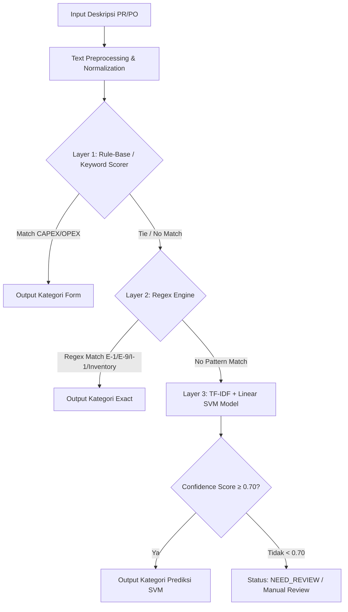

# Mesin Kecerdasan Buatan (AI Engine) & Algoritma Klasifikasi

> PT Summit Adyawinsa Indonesia — Smart Budget Monitoring & QC System  
> Pipeline Klasifikasi: **3-Layer Hybrid Architecture (Rule-Base → Regex Engine → SVM Classifier)**

---

## 1. Ringkasan Arsitektur AI

Sistem menggunakan pendekatan **Hybrid AI/ML** untuk mengklasifikasikan deskripsi Purchase Request (PR) dan Purchase Order (PO) ke dalam kategori budget yang tepat secara otomatis, cepat, dan deterministik sebelum dialihkan ke model Machine Learning.



---

## 2. Rincian Layer Klasifikasi

### Layer 1: Rule-Base Budget Type Detector (`backend/ai/rule_base.py`)
Mendeteksi apakah transaksi tergolong **CAPEX (Capital Expenditure)** atau **OPEX (Operational Expenditure)** berdasarkan bobot kemunculan kata kunci umum.

* **CAPEX Keyword Rules**:
  - `NEW MACHINE`, `NEW EQUIPMENT`, `INVESTMENT`, `INSTALLATION`, `PURCHASE`, `PROJECT`, `ASSET`
* **OPEX Keyword Rules**:
  - `MAINTENANCE`, `REPAIR`, `SPARE PART`, `SPAREPARTS`, `CONSUMABLE`, `SERVICE`

* **Logika Keputusan**:
  - Jika skor CAPEX > skor OPEX &rarr; Kategori `CAPEX` (Rule Base).
  - Jika skor OPEX > skor CAPEX &rarr; Kategori `OPEX` (Rule Base).
  - Jika seimbang atau tidak ada kecocokan &rarr; Diteruskan ke **Layer 2**.

---

### Layer 2: Regex Engine Pattern Matcher (`backend/ai/regex_engine.py`)
Mendeteksi kode formulir eksplisit dan kata kunci inventaris khusus departemen QC.

* **Pola Kode Form Eksplisit**:
  - `\bI[- ]?1\b` &rarr; Kategori **I-1 (Inventory)**
  - `\bE[- ]?1\b` &rarr; Kategori **E-1 (Maintenance)**
  - `\bE[- ]?9\b` &rarr; Kategori **E-9 (Other Expense)**

* **Pengecualian Jasa / Perbaikan**:
  Jika terdapat indikator perbaikan seperti `REPAIR`, `SERVICE`, `PERBAIKAN`, `BENERIN`, sistem memblokir klasifikasi ke `I-1` agar diarahkan ke kategori perawatan (`E-1`).

* **Kata Kunci Inventaris Fisik**:
  - `KUNCI L`, `KUNCI SHOCK`, `TOOLBOX`, `TOOL SET`, `TOOL BOX`, `PEMOTONG KERTAS` &rarr; Kategori **I-1**.

---

### Layer 3: Machine Learning — TF-IDF Vectorizer + Support Vector Machine (SVM)
Jika Layer 1 dan 2 tidak menemukan pola pasti, teks dialihkan ke model Machine Learning:

* **Preprocessor (`backend/ai/preprocess.py`)**:
  - Lowercase normalization.
  - Penghapusan karakter non-alfanumerik & whitespace berlebih.
  - Pembersihan noise teks transaksi procurement.
* **Feature Extraction**:
  - `TfidfVectorizer` dengan n-gram range (1, 2).
* **Classifier**:
  - `SVC(kernel='linear', probability=True)`
* **Confidence Threshold**:
  - Ambang batas keyakinan standar: **`0.70` (70%)**.
  - Jika `max(predict_proba) < 0.70`, hasil ditandai sebagai **`UNKNOWN`** atau **`NEED_MAPPING / NEED_REVIEW`** untuk ditinjau manual oleh tim QC/Finance.

---

## 3. Algoritma Pencocokan Item Planning (Fuzzy Matching)

Setelah kategori budget teridentifikasi, item PR/PO dipetakan ke **Planning Detail Bulanan** menggunakan **Advanced Mapping Engine** (`backend/services/mapping/advanced_mapping_service.py`):

1. **Item Mapping Rule Match**:
   Mencari kecocokan dari tabel master `item_mapping` berdasarkan prioritas kata kunci yang telah di-maintain oleh admin.
2. **Fuzzy String Matching (RapidFuzz)**:
   Jika tidak ada rule eksplisit, sistem menghitung skor kesamaan string (`token_sort_ratio` & `partial_ratio`) antara deskripsi PR dengan nama item pada daftar planning di bulan yang bersangkutan.
3. **Threshold Auto-Assignment**:
   - Skor ≥ 85%: Otomatis dihubungkan (`planning_detail_id` terisi).
   - Skor 60% – 84%: Dimasukkan ke antrean **Mapping Review** (`/pr/mapping-review`) dengan daftar kandidat terurut.
   - Skor < 60%: Status `NEED_MAPPING` untuk assignment manual.

---

## 4. Alur Pelatihan Ulang Model (Model Retraining)

Data hasil koreksi manual oleh pengguna disimpan di tabel `pr_po_data` (kolom `kategori_id_koreksi` dan `direview_oleh`) yang dapat diekspor untuk memperkaya dataset training model SVM.

### Langkah Retraining:
1. Ekspor data terverifikasi dari database:
   ```sql
   SELECT description, kategori_id 
   FROM pr_po_data 
   WHERE kategori_id IS NOT NULL;
   ```
2. Latih ulang vectorizer dan model SVM menggunakan scikit-learn.
3. Simpan model baru ke `backend/model/svm_model.pkl`.
4. Jalankan unit test:
   ```bash
   PYTHONPATH=backend pytest backend/tests/test_regex_engine.py
   ```
