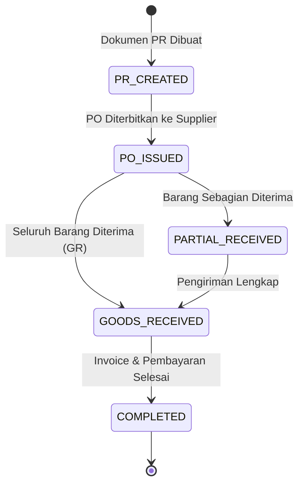

# Proses Bisnis & Alur Kerja Monitoring Anggaran QC

> PT Summit Adyawinsa Indonesia — Quality Control (QC) Department  
> Dokumen Standar Operasional & Logika Bisnis Sistem Monitoring Anggaran

---

## 1. Latar Belakang & Tujuan

Departemen Quality Control (QC) PT Summit Adyawinsa Indonesia mengelola alokasi anggaran tahunan untuk pemeliharaan peralatan uji, kalibrasi, pengadaan alat ukur (tools), dan perlengkapan operasional. 

Tantangan utama yang diselesaikan oleh sistem ini:
1. **Otomatisasi Kategori Budget**: Mengeliminasi kesalahan penentuan kode formulir pengajuan PR/PO.
2. **Monitoring Realisasi Real-Time**: Membandingkan nominal rencana bulanan (*planning budget*) terhadap aktual belanja (*actual PR/PO expenditure*).
3. **Pelacakan Siklus Procurement**: Memantau progress dari pembuatan PR hingga barang diterima (*Goods Received*) dan penagihan (*Invoice*).

---

## 2. Struktur Kategori Anggaran (Budget Categories)

Anggaran departemen terbagi menjadi 2 tipe utama formulir:

| Kode Kategori | Nama Kategori | Tipe Formulir | Contoh Item Belanja |
|:---|:---|:---|:---|
| **E-1** | Maintenance & Repair | OPEX | Jasa servis CMM, kalibrasi roughness tester, perbaikan fixture |
| **E-9** | Other Operating Expense | OPEX | Alat tulis kantor QC, consumable kimia, sarung tangan uji |
| **I-1** | Tools & Inventory Asset | CAPEX | Kunci L set, micrometer digital, height gauge, tool cabinet |
| **CAPEX** | Capital Investment | CAPEX | Mesin ukur baru, fasilitas laboratorium QC baru |

---

## 3. Siklus Hidup Dokumen Procurement (Procurement Lifecycle)

Setiap pengadaan barang/jasa melalui tahapan status procurement berikut:



### Definisi Status Procurement:
1. **`PR_CREATED`**: Purchase Requisition tercatat di sistem ERP internal.
2. **`PO_ISSUED`**: Purchase Order resmi telah dikirimkan ke vendor/supplier.
3. **`PARTIAL_RECEIVED`**: Sebagian kuantitas pesanan telah tiba di gudang/pabrik.
4. **`GOODS_RECEIVED`**: Seluruh fisik barang telah diterima dan diverifikasi oleh QC (*Packing Slip / GR Number* terbit).
5. **`COMPLETED`**: Invoice vendor telah diterima dan proses pembayaran selesai.

---

## 4. Logika Status Realisasi Anggaran (Budget Status Logic)

Setelah item PR/PO dipetakan ke item rencana (*Planning Detail*), sistem menghitung status anggaran:

```
                  ┌────────────────────────────────────────┐
                  │ Akumulasi Total Aktual vs Plan Amount   │
                  └───────────────────┬────────────────────┘
                                      │
              ┌───────────────────────┼───────────────────────┐
              ▼                       ▼                       ▼
    [Aktual ≤ Nominal Plan]   [Aktual > Nominal Plan]   [Tanpa Item Plan]
              │                       │                       │
              ▼                       ▼                       ▼
         `ON_PLAN`               `OVER_PLAN`                `OOP`
      (Sesuai Rencana)        (Melebihi Budget)       (Out of Planning)
```

| Status Anggaran | Kriteria & Kondisi | Tindakan Sistem / Notifikasi |
|:---|:---|:---|
| **`ON_PLAN`** | Total pengeluaran aktual masih di bawah atau sama dengan nominal planning bulanan. | Indikator Hijau pada Dashboard; Realisasi normal. |
| **`OVER_PLAN`** | Akumulasi pengeluaran PR melebihi alokasi nominal planning untuk item tersebut. | Indikator Merah pada Dashboard; Membutuhkan persetujuan manajerial. |
| **`UNDER_PLAN`** | Hingga akhir periode bulan, pengeluaran aktual jauh di bawah proyeksi rencana. | Indikator Kuning; Evaluasi penyerapan anggaran. |
| **`OOP` (Out of Plan)** | Pengajuan PR dilakukan tanpa ada alokasi pada dokumen planning awal tahun. | Ditandai sebagai belanja darurat/tak terduga. |

---

## 5. Alur Audit & Koreksi Manual (Review Queue)

Jika sistem AI tidak memiliki kepastian tinggi (skor < 70% atau status `NEED_MAPPING`), alur peninjauan manual dijalankan:

1. **Notifikasi Badge**: Menu **Mapping Review** (`/pr/mapping-review`) menampilkan counter data yang butuh peninjauan.
2. **Pemeriksaan Pengguna**: Manager atau Admin memeriksa deskripsi PR, nama vendor, dan konteks pembelian.
3. **Pilihan Tindakan**:
   - **Koreksi Kategori**: Mengubah kode formulir yang benar (misal dari E-9 ke E-1).
   - **Pilih Planning Detail**: Memilih item rencana yang sesuai dari daftar drop-down / auto-suggest.
   - **Batalkan PR**: Memberikan catatan alasan pembatalan jika pengadaan tidak valid.
4. **Audit Trail**: Sistem mencatat nama user (`direview_oleh`), waktu review (`direview_at`), dan menyimpan histori di `mapping_log`.
